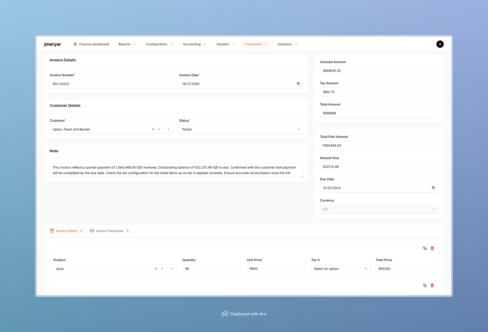

# Jmeryar Accounting

Jmeryar is a robust accounting application built with a focus on flexibility, transparency, and extensibility. Developed to streamline accounting processes, Jmeryar integrates key features for handling invoices, bills, payments, journal entries, inventory management, and more. It is designed for use in commercial environments and is versatile enough for both small businesses and enterprise applications.



## Table of Contents

- [Features](#features)
- [Installation](#installation)
- [Usage](#usage)
- [Core Modules](#core-modules)
- [Roadmap](#Roadmap)
- [Contributing](#contributing)
- [License](#license)
- [Tests](#tests)

## Features

- **Invoice and Bill Management**: Manage and track invoices and bills with automated journal entries for accounting consistency.
- **Inventory Management**: Manage inventory with FIFO (First-In-First-Out), allowing for accurate cost tracking when items are purchased at different prices.
- **Accounting Journals**: Track financial transactions, with each transaction maintaining a `debit` and `credit` entry for accurate double-entry accounting.
- **Payments System**: Handle payments that can be associated with either invoices or bills, supporting various payment methods (e.g., cash, credit, bank).
- **Automatic Calculations**: Total amounts, outstanding balances, and inventory adjustments are automatically updated.
- **Reports**: Generate essential financial reports based on journal entries, invoices, and bills.

## Installation

1. **Install via Composer**:

   ```bash
   composer require xoshbin/jmeryar-accounting
   ```

2. **Run migrations**:

   ```bash
   php artisan migrate
   ```

3. **Publish vendor files**:

   ```bash
   php artisan vendor:publish --provider="Xoshbin\JmeryarAccounting\AccountingServiceProvider"
   ```

4. **Install NPM dependencies and build assets**:

   ```bash
   npm install && npm run build
   ```

5. **Add Accounting to your Filament plugin list in your FilamentServiceProvider:**:
   (usually located in app/Providers/Filament/AdminPanelProvider.php)

   ```php
   use Xoshbin\JmeryarAccounting\Accounting;

   class AdminPanelProvider extends PanelProvider
   {
    public function panel(Panel $panel): Panel
    {
        return $panel
            // some other configurations
            ->plugins([
                new Accounting()
            ]);
    }
   }
   ```

6. **Optional: Seed your database with base data**:

   ```bash
   php artisan jmeryaraccounting:install
   ```

   This command will prompt you to enter essential data such as company information and base currency, and then populate your database with essential data including accounts, currencies, product categories, and taxes.

7. **Optional: Fully seed the database with dummy data**:

   ```bash
   php artisan jmeryaraccounting:install --dummy
   ```

   This command will populate your database with sample data including products, customers, suppliers, invoices, and bills.

## Usage

Once you have completed the installation steps, you can start using Jmeryar Accounting in your application. Here are the basic steps to get started:

1. **Create Products**:

   - Navigate to the Products section in your application.
   - Add new products with details such as name, price, and inventory quantity.

2. **Create a Bill**:

   - Go to the Bills section.
   - Create a new bill by selecting a supplier and adding items (products) to the bill.
   - Save the bill to update inventory.

3. **Create an Invoice**:

   - Navigate to the Invoices section.
   - Create a new invoice by selecting a customer and adding items (products) to the invoice.
   - Save the invoice to generate journal entries and update inventory.

4. **Record Payments**:

   - Go to the Payments section.
   - Record payments against invoices or bills by selecting the appropriate invoice/bill and entering payment details.

5. **Visit the Dashboard**:

   - Access the Dashboard to view an overview of your financial metrics, revenue, and expenses.

6. **Generate Reports**:
   - Navigate to the Reports section.
   - Generates financial reports such as income statements, balance sheets, and cash flow reports to analyze your financial data.

## Core Modules

### Invoices and Bills

Invoices and Bills are at the core of the application, allowing users to track customer sales and supplier purchases. Each has multiple items and supports automatic calculations of totals and due amounts.

### Inventory Management

Each time an item is added to a bill, a new inventory batch is created or updated. When an invoice item is sold, inventory is adjusted using FIFO, ensuring accurate cost tracking even with fluctuating prices.

### Journal Entries

The app utilizes double-entry accounting principles. Each transaction records a debit and a credit journal entry, which are associated with invoices, bills, or payments.

### Payments

Payments are handled as polymorphic entities, which means a payment can belong to either a bill or an invoice. This allows flexibility in associating transactions with different types of accounts payable and receivable.

## Roadmap

- [x] **Add inventory with FIFO (First in first out)**
- [x] **Multiple Currency Support**
- [x] **Write Tests**
- [x] **Printable Invoices**:
- [ ] **Add notifications for due dates (in app notifications)**:
- [ ] **Add notifications for inventory - Out of stocks**:
- [x] **Tax Management**
- [x] **Add discounts**.
- [ ] **Dashboard Charts**: Introduce visual dashboards to display key financial metrics, such as cash flow, revenue, and expenses.
- [x] **Financial Reports**: Develop reporting tools for financial analysis, including income statements, balance sheets, and cash flow reports.

## Contributing

1. Fork the repository.
2. Create your feature branch: `git checkout -b feature/your-feature-name`.
3. Commit your changes: `git commit -m 'Add your feature'`.
4. Push to the branch: `git push origin feature/your-feature-name`.
5. Open a pull request.

We welcome contributions that improve the app, add features, or fix bugs.

## License

This project is licensed under the LGPLv3 license.

### Third-Party Licenses

This project makes use of the [Filament](https://github.com/filamentphp/filament) package, which is licensed under the MIT license. The original copyright notice for Filament is included in this repository.

## Tests

This package heavily depends on tests to ensure the accuracy of invoice and bill calculations, as well as the correctness of journal entries and inventory batches. Running tests is crucial to maintain the integrity of the accounting processes.

Use the following command to run the tests:

```bash
composer test
```

**Writing tests**:

When contributing to the project, ensure you write tests for any new features or bug fixes. Place your tests in the `tests` directory and follow the existing structure and naming conventions.
